<div align="center">

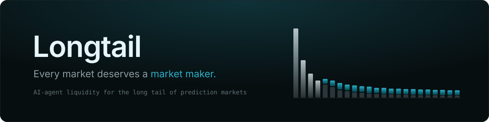

<p>
  <a href="https://longtail-rosy.vercel.app"></a>
  <a href="https://longtail-rosy.vercel.app/app/earn"></a>
  
  
  
  
</p>

<p>
  <a href="https://longtail-rosy.vercel.app"><b>Live app</b></a> ·
  <a href="#-try-it-in-2-minutes"><b>Try it</b></a> ·
  <a href="#-how-it-works"><b>How it works</b></a> ·
  <a href="#-results"><b>Results</b></a> ·
  <a href="#-run-it-locally"><b>Run locally</b></a>
</p>

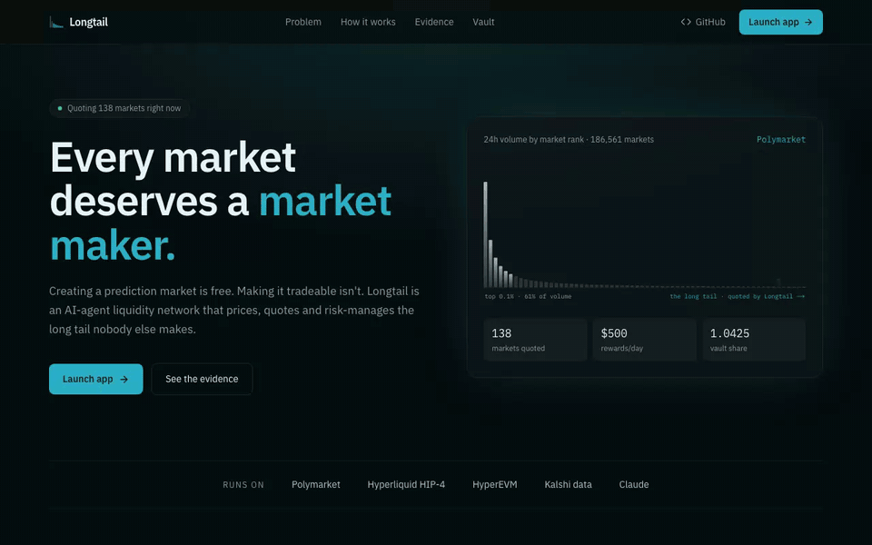

</div>

<br />

**Longtail is an AI-agent liquidity network for the long tail of prediction markets.** Creating a market is now nearly free; making it tradeable isn't. Longtail prices, triages and quotes the thousands of thin markets nobody makes, with a risk engine built to survive the adverse selection that makes long-tail market making lose money.

<details>
<summary><b>Table of contents</b></summary>

- [The problem](#-the-problem)
- [How it works](#-how-it-works)
- [Product tour](#-product-tour)
- [Try it in 2 minutes](#-try-it-in-2-minutes)
- [Results](#-results)
- [On-chain](#-on-chain)
- [Architecture](#-architecture)
- [Run it locally](#-run-it-locally)
- [Limitations, plainly](#-limitations-plainly)

</details>

## 📉 The problem

A full census of every open Polymarket market (Oct 3, 2026, `pnpm census`):

<table>
<tr>
<td align="center" width="25%"><h2>186,561</h2>open markets with an order book</td>
<td align="center" width="25%"><h2>61%</h2>of 24h volume in the top 0.1% (186 markets)</td>
<td align="center" width="25%"><h2>$4</h2>median depth within ±2¢ on the long tail</td>
<td align="center" width="25%"><h2>$29.2k/day</h2>maker rewards already on offer there</td>
</tr>
</table>

The bottom 90% of markets (167,905) get roughly **0%** of the volume, and 62% of slow-information markets traded **nothing** in 24 hours. It isn't a Polymarket quirk: **Kalshi** lists 131,920 open markets with 82% of volume in the top 1% and 83% idle, and **Hyperliquid HIP-4** outcome books show a 45¢ 75th-percentile spread.

Venues pay makers to fix this, and almost nobody does, because naive market making there **loses 39% of capital** to better-informed traders (see [Results](#-results)). The hard part isn't quoting. It's knowing which markets *not* to quote.

## 🧠 How it works

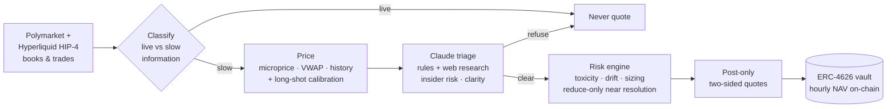

| Step | What it does |
|---|---|
| **Classify** | *Live-information* markets (in-play sports, weather, price-at-expiry) settle from public feeds; anyone watching the feed beats a resting quote, so Longtail never quotes them. *Slow-information* markets (elections, policy, tech, culture) are where a model can hold its own. |
| **Price** | Fair value blends the live microprice (weighted by book tightness), decayed trade VWAP, last print and history, then runs through a **calibration curve fitted on resolved markets**. Prediction markets overprice long shots: markets priced at 15¢ resolved YES about 8% of the time. |
| **Triage** | A **Claude** agent reads the exact resolution rules, searches the news, and scores insider risk and rule clarity. It refuses any market with insider risk > 0.3 or clarity < 0.6. |
| **Risk** | Flow toxicity from fill markouts, one-sided flow, news shocks, drift guard, worst-case position limits, category and portfolio caps, reduce-only 72h out and a full pull 24h before resolution. |
| **Quote** | Post-only, skewed against inventory, and stepping inside a venue's reward band only when its own risk spread is already close. On HIP-4 a quote is a bid on YES plus a bid on NO, so it needs no inventory and can't be liquidated. |
| **Account** | LPs fund an ERC-4626 vault. The keeper deploys to venue accounts and posts NAV on-chain every hour, each report pinned to the hash of the published positions and capped at ±5%. |

## 📸 Product tour

<table>
<tr>
<td width="50%">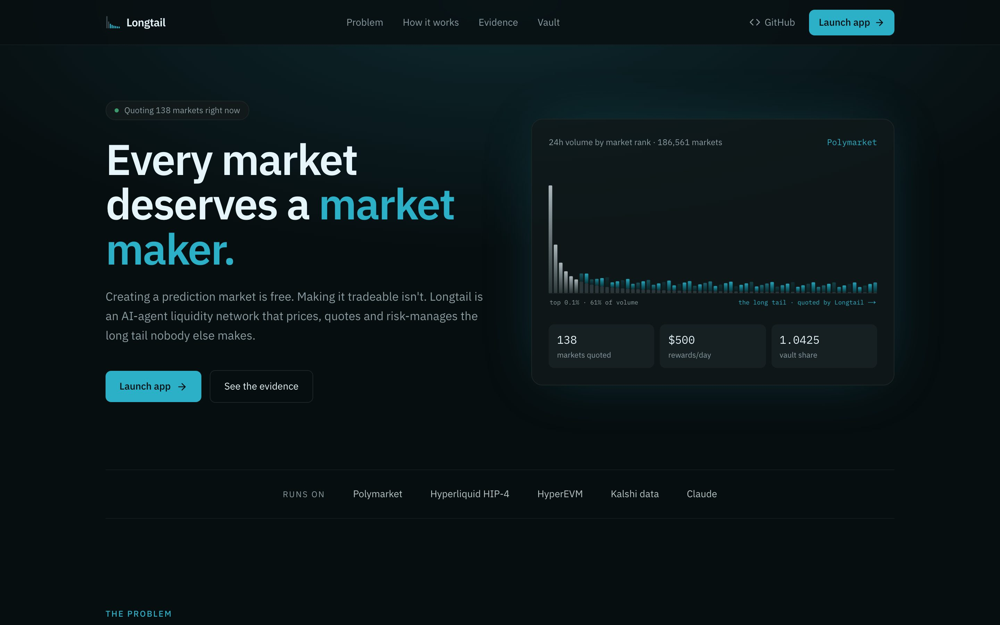<p align="center"><b>Landing</b>: the problem, the evidence and one call to action</p></td>
<td width="50%">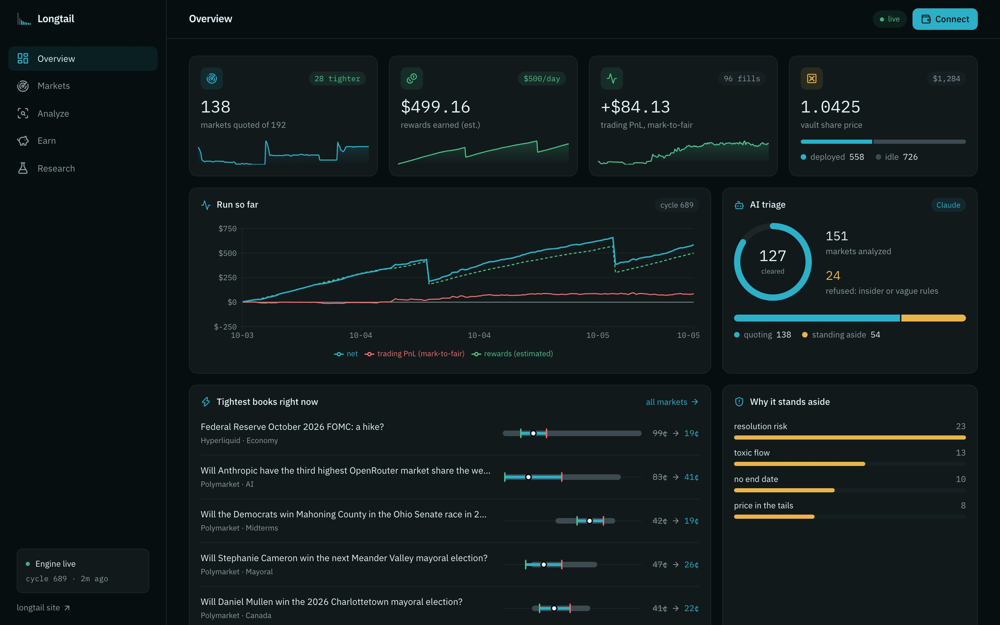<p align="center"><b>Overview</b>: live KPIs, run chart, AI triage and the tightest books</p></td>
</tr>
<tr>
<td>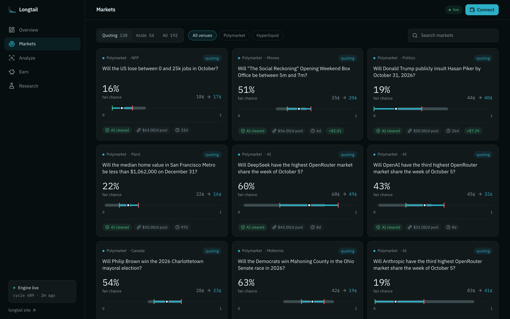<p align="center"><b>Markets</b>: every market the engine watches, as a card feed</p></td>
<td>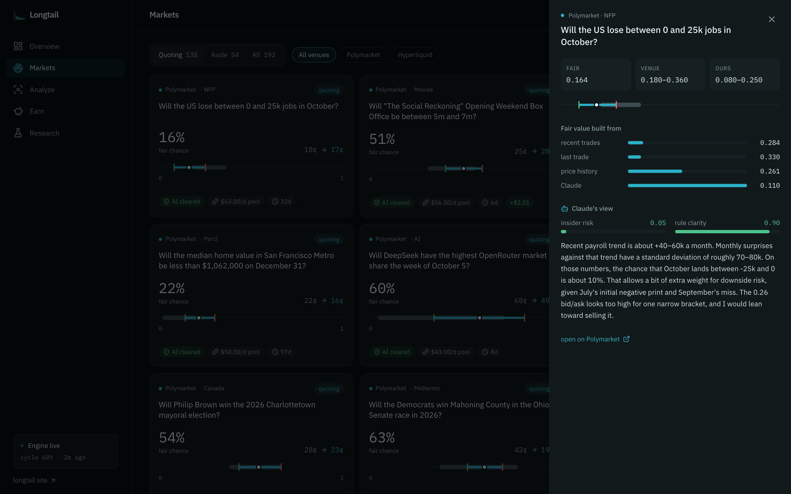<p align="center"><b>Market detail</b>: what fair value is built from, Claude's view, and the risk verdict</p></td>
</tr>
<tr>
<td>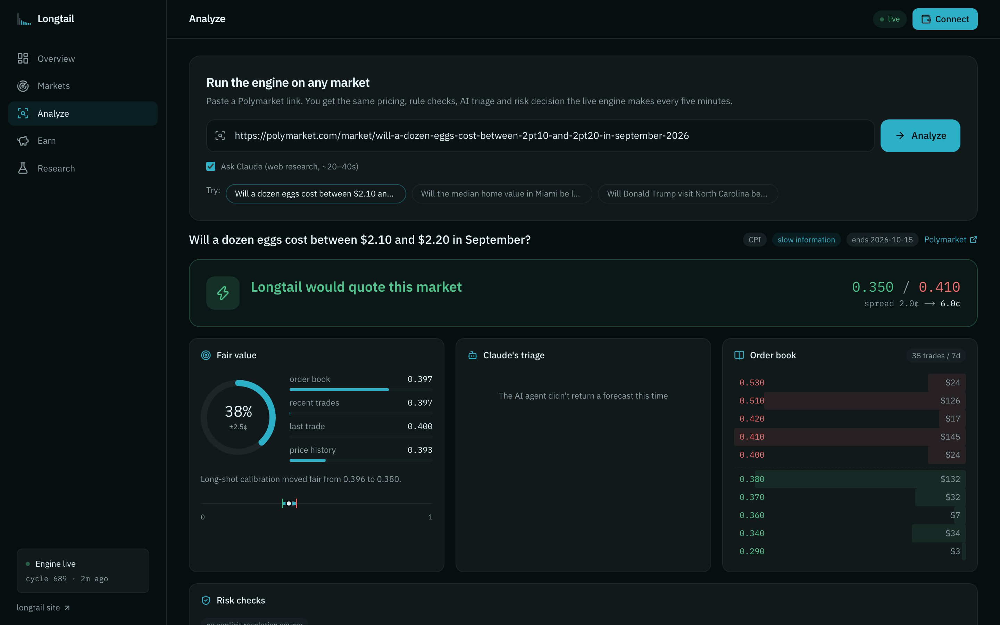<p align="center"><b>Analyze</b>: paste any Polymarket link and run the live engine on it</p></td>
<td>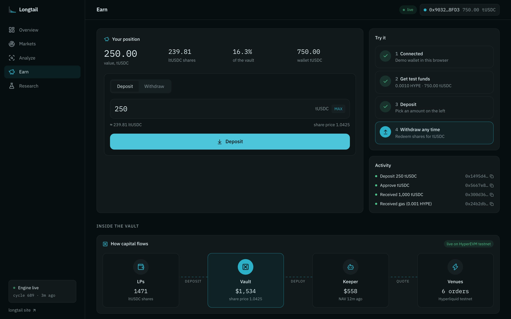<p align="center"><b>Earn</b>: demo wallet, test funds, deposit and withdraw on testnet</p></td>
</tr>
<tr>
<td>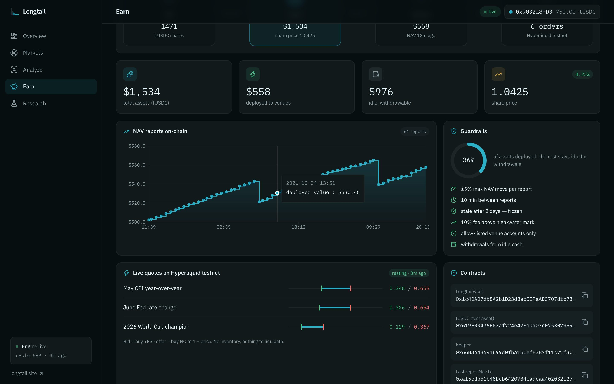<p align="center"><b>Vault</b>: capital flow, on-chain NAV reports and live HIP-4 quotes</p></td>
<td>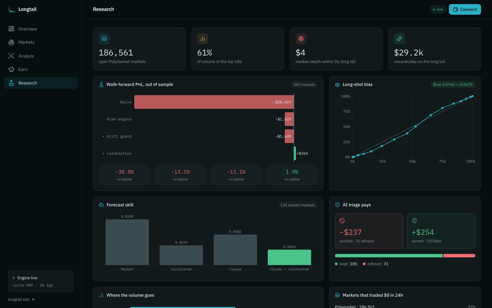<p align="center"><b>Research</b>: census, walk-forward backtest, calibration and AI evaluation</p></td>
</tr>
</table>

<p align="center">
  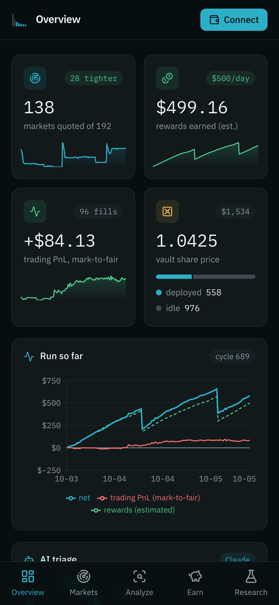
  &nbsp;&nbsp;
  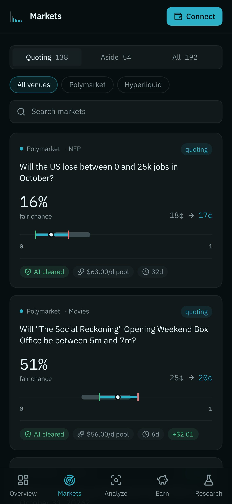
  <br /><sub>Works on phones too, with a bottom tab bar and card feeds.</sub>
</p>

## 🚀 Try it in 2 minutes

No install and no real money: everything runs on HyperEVM and Hyperliquid **testnet**.

1. Open **[/app/earn](https://longtail-rosy.vercel.app/app/earn)** → **Start** → **Demo wallet** (or connect MetaMask/Rabby; the app adds HyperEVM testnet for you).
2. **Get test funds**: the faucet sends gas and 1,000 tUSDC.
3. **Deposit**, and watch your ltUSDC shares and the vault totals update. **Withdraw** any time.
4. Open **[/app/analyze](https://longtail-rosy.vercel.app/app/analyze)** and paste any Polymarket link. The engine prices it, Claude researches it, and the risk engine decides whether to quote it and at what prices.
5. **[/app/markets](https://longtail-rosy.vercel.app/app/markets)** shows every market the engine is watching right now. Tap a card to see why it's quoted or refused.

## 📊 Results

### Walk-forward backtest: 963 resolved markets, 26 weeks

Re-quotes every 15 minutes using only information available at the time. Fills happen only on real taker prints *strictly through* our price (back of queue), capped at print size, and settle at the real outcome. The calibration curve is fitted on the **older half only**; every arm is scored on the **newer half** (482 markets).

| Arm (out of sample) | PnL after settlement | On peak capital | Worst market |
|---|---:|---:|---:|
| Naive (fixed 2¢ half-spread, no limits) | **−$28,469** | −38.8% | −$1,182 |
| Risk engine | −$1,629 | −13.1% | −$146 |
| + drift guard | −$1,620 | −13.1% | −$136 |
| **+ calibration (Longtail)** | **+$354** | **+1.9%** | −$225 |

Calibration also improves forecasts out of sample (Brier 0.0706 → 0.0670). Read honestly: Longtail brings spread PnL to roughly break-even on markets it has never seen, and venue rewards, which the replay doesn't count, are the margin.

### The AI agent, on markets after its training cutoff

136 slow-information markets that resolved **after** Claude's training cutoff, forecast 7 days out with web search off.

| Forecast | Brier (lower is better) |
|---|---:|
| Market price | 0.0598 |
| Calibrated price | 0.0570 |
| Claude alone | 0.0582 |
| **Claude + calibrated price** | **0.0565** |

**Triage matters more than forecasting:** the markets the agent refused lost **−$237** in replay, and the ones it kept made **+$254**. It's a small sample, so treat it as early evidence.

### Live

| | |
|---|---|
| **Paper run 1** (Oct 1–3) | 30 fills, −$142. Three markets caused −$151 (a reality-TV contestant, a "will Trump say…" mention market, a company-decided outcome); those categories are now excluded by rule, and the agent refuses what the rules miss. |
| **Paper run 2** (Oct 3 → now) | ~140 markets quoted every 5 minutes. By Oct 5: 96 fills, **+$84** trading PnL and about $1,000 in *estimated* rewards. Live numbers are on the [Overview](https://longtail-rosy.vercel.app/app). |
| **Hyperliquid HIP-4 testnet** | Real resting orders from the same engine, with real fills on both sides. |
| **HyperEVM testnet vault** | 50+ hourly `reportNav` transactions so far. |

## ⛓️ On-chain

| Contract (HyperEVM testnet, chain 998) | Address |
|---|---|
| `LongtailVault` (ERC-4626) | [`0x1c4DA07db8A2b1D23dBecDE9aAD3707dfc733AfC`](contracts/broadcast/Deploy.s.sol/998/run-latest.json) |
| `TestUSDC` (tUSDC, public mint) | `0x619E00476F63af724e478aDa07c07530795943be` |
| Keeper (also the HIP-4 account) | `0x66B3A4B691699d0fbA15CefF3B7f11c71f3C9667` |

Vault guardrails: max ±5% NAV move per report, at least 10 minutes between reports, NAV goes stale after 2 days and then freezes deposits and withdrawals, a 10% fee only above the high-water mark, capital can only go to allow-listed venue accounts, and withdrawals are paid from idle cash.

## 🏗️ Architecture

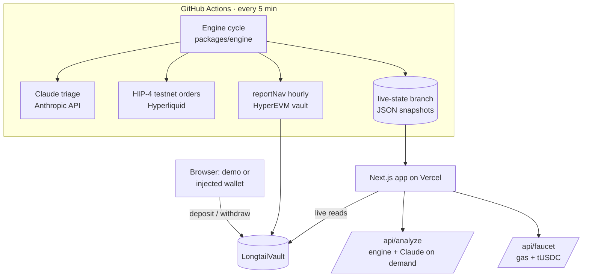

```
packages/core     venue adapters: Polymarket (Gamma, CLOB, Data API, rewards), Hyperliquid HIP-4, Kalshi; DNS-over-HTTPS
packages/engine   forecast · calibration · rules/regime · toxicity · risk · quoter · rewards · paper exchange · replay
  src/llm.ts      Claude forecasting and triage agent (web search + structured output)
  src/live        resumable live engine, HIP-4 executor
  src/cli         census · backtest · universe · paper · cycle · eval-llm · hip4-testnet · report-nav · rewards
contracts         LongtailVault.sol (ERC-4626) + Foundry tests + deploy script
apps/web          landing page (/) and app (/app: Overview · Markets · Analyze · Earn · Research), Next.js 16
scripts           engine-loop.sh: the CI loop that cycles, quotes, reports NAV and publishes
```

**Built with:** TypeScript · Node 24 · Next.js 16 · Tailwind · Recharts · viem · Solidity · Foundry · OpenZeppelin · `@nktkas/hyperliquid` · Claude Opus 5.5 (Anthropic SDK) · GitHub Actions · Vercel · Vitest · Claude Code.

## 💻 Run it locally

```bash
pnpm install
pnpm rewards                       # snapshot reward configs
pnpm census                        # full market census (~20 min, caches data/pm-markets.json)
pnpm backtest 26 40                # fetch + replay; add --cached to re-run instantly
pnpm universe                      # pick the reward-paying long tail (~3 min)
pnpm paper 60                      # live paper quoting (resumable)
pnpm --filter web dev              # the app on :3000
pnpm test                          # engine tests (27)
cd contracts && forge test         # vault tests (9)
```

| Variable | Purpose |
|---|---|
| `ANTHROPIC_API_KEY` | Turns on the Claude agent (`LONGTAIL_LLM_MODEL`, `LONGTAIL_LLM_EFFORT` tune cost) |
| `KEEPER_PRIVATE_KEY` | Testnet keeper: HIP-4 orders and vault NAV reports |
| `FAUCET_PRIVATE_KEY` | Testnet faucet behind `/api/faucet` |
| `LONGTAIL_DATA_URL` · `LONGTAIL_SNAPSHOT_URL` | Where the app reads live state and research snapshots |
| `LONGTAIL_DOH=0` | Disable DNS-over-HTTPS (on by default, for networks that block venue domains) |

## ⚠️ Limitations, plainly

- **Polymarket trading is paper.** Fills are simulated against real taker prints; they don't capture queue priority or our own market impact. Hyperliquid orders and the vault are real but on **testnet**.
- **Rewards are estimated**, not earned. The backtest excludes rewards entirely because historical reward configs aren't published.
- **The agent's evaluation is small** (136 markets).
- **The vault is tested, not audited.** Its NAV mirrors the paper run, not real venue positions.
- **Kalshi is read-only** (census only). Trading needs a US-regulated account.
- **The regime and insider rules are heuristics**, conservative by design.

<br />

<div align="center"><sub>Built for the Colosseum Crypto World's Fair hackathon, October 2026. All code in this repo was written during the hackathon.</sub></div>
